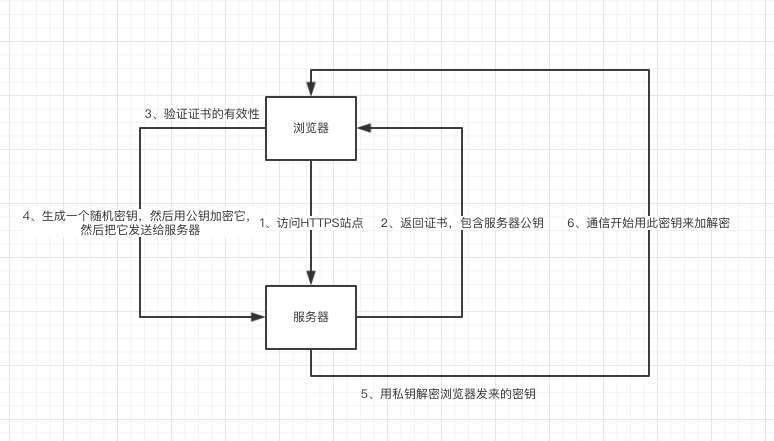

# HTTPS 简介与流程

启用 HTTPS 需要在服务器端做一些设置，包括购买/获得一个 SSL 证书(certificate)——它 是服务器的身份证，有了它才能进行加密传输。

关于 SSL 证书需要注意的是:
证书由一个权威机构(Certificate Authority，简称 CA)提供，并有一定时效(一般以年 为单位)，过期失效 。
证书提供一对密钥:公钥和私钥。服务器对外发布公钥以声明自己的身份，但私钥只有 自己能读取，用来证实自己的身份。

浏览器在访问一个 HTTPS 站点时，首先通过一个“握手”(handshake)过程得到一个密钥(并 非前述的公钥/私钥)，然后通过这个密钥加密此后的 HTTP 传输。握手的过程如下(中间如 有任何一步失败则握手失败):

另外:
用公钥加密的密文只有用私钥才能解开，这属于一种“非对称加密”方法
以上第 6 步中的密钥是一种“对称”密钥:使用同一把密钥进行加密和解密
