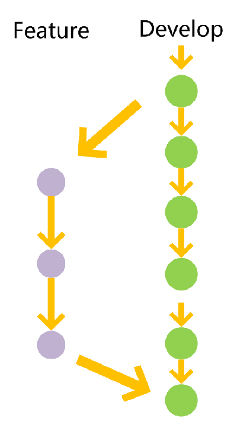

## Git 工作流和分支规范
一个规范的 Git 工作流方式，对团队的效率，项目的质量，上线的稳定都有不错的帮助。[参考链接](https://www.imooc.com/article/285446).

在此盗图两张，简直完美：

依据上图，我们可以分为：永久分支，临时分支。
## 永久分支
  1. master(稳定版)
        
        主分支，只用来发布重大版本。**所有提供给用户使用的正式版本，都在这个主分支上发布。**

  1. develop(开发版)
   
        日常开发便是基于此分支，

        

## 临时分支

临时分支主要分3种：
- 功能（feature）分支
- 预发布（release）分支
- 修复Bug（hotfix）分支

这三种分支使用完以后，应该删除。

1. feature 分支
   功能分支，是为了开发某种特定的功能，从 develop 分支上面分出来的。开发完成后，在合并入 develop 分支

    

2. release 分支
   
   预发布分支，是指发布正式版本之前，我们需要此版本来进行体验测试。预发布分支是从Develop分支上面分出来的，预发布结束以后，必须合并进Develop和Master分支。它的命名，请采用release/release1的形式。

3. hotfix 分支
   
    修补bug分支。软件正式发布以后出现bug，这时就需要创建一个分支，进行bug修补。修补bug分支是从Master分支上面分出来的。修补结束以后，再合并进Master和Develop分支。它的命名，请采用hotfix/fixbug1的形式。
    

## 代码分支提交使用规范

- 使用Git过程中，必须通过创建分支进行开发，坚决禁止在主干分支上直接开发。

- 在Git中，默认是不会提交空目录的，如果想提交某个空目录到版本库中，需要在该目录下新建一个.gitignore 的空白文件，就可以提交了。

- 提交时，一定要填写有意义的注释。注释内容要求如下：第一行为提要，然后逐行罗列出功能点、主要变动、以及需要注意的问题等等。具体如下所示：

